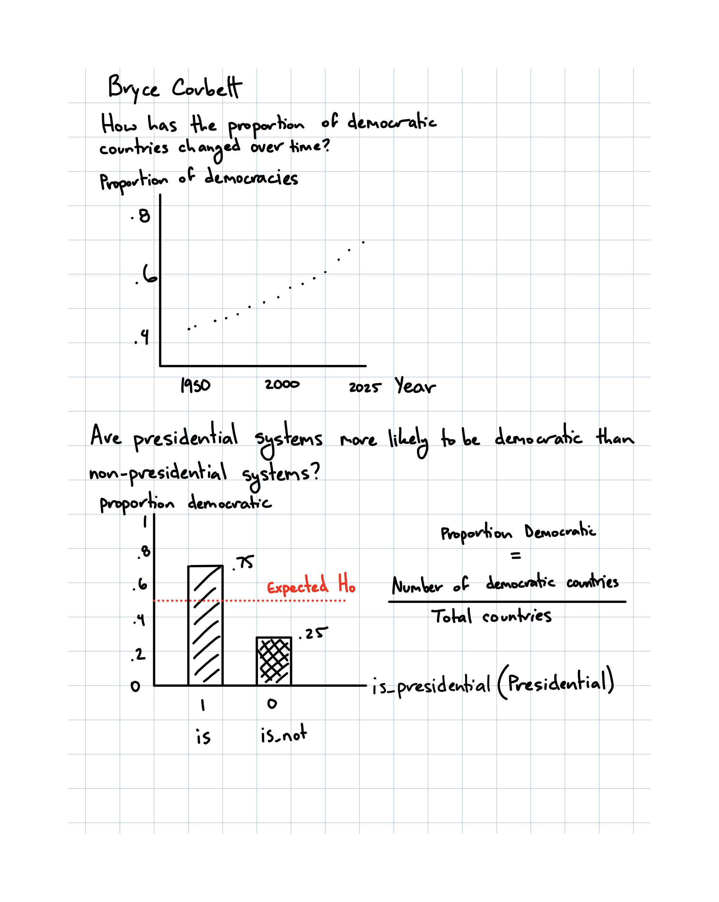

**Context and Data Cleaning**\

The Democracy-Dictatorship dataset was created to support research on political regimes and transitions between them over time. It compiles information on regime characteristics at a country level and aims to focus on changes over time. The dataset includes over 9,000 observations.\

The dataset was updated to include information through 2025. This added three new countries and sixteen territories. Several logical variables were also renamed for clarity such as, is_colony and is_communist were changed to colony and communist.\

**Two Research Questions With This Data**\
**1** How has the proportion of democratic countries changed over time?
(x: year, y: proportion of democracies)\

**2** Are presidential systems more likely to be democratic than non-presidential systems?
(x: system type (is_presidential), y: proportion democratic)\

**Two Research Questions With Supplemental Data**\
**1** How does GDP per capita relate to the likelihood of democracy?
(x: GDP per capita, y: is_democracy)\

**2** Does higher education level increase the probability of a country being democratic?
(x: average education level, y: is_democracy)\

**Visualizations**\

